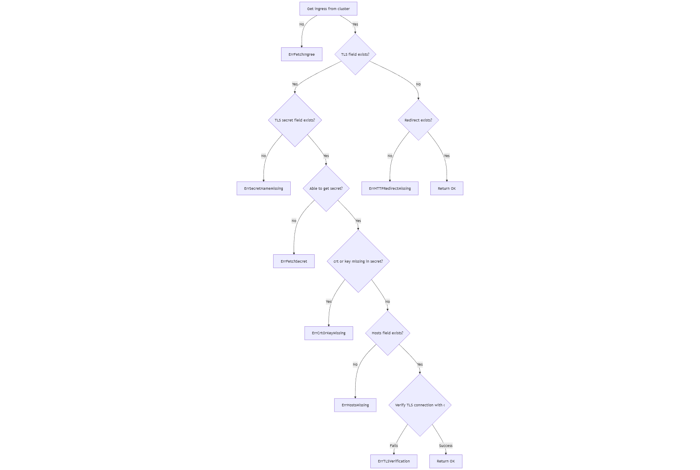

# ingress-auditor
A project that apply a simple Kubernetes operator monitoring ingresses across namespaces. If it finds any ingress in the cluster that isn't secured by a TLS certificate, it logs an error.

## Requirements

1. Monitor Ingress resources across namespaces and log abnormalities when TLS is missing.
2. Allow HTTP endpoints without error logs if the endpoint only returns redirects (HTTP 301/302).
3. Log each issue at most once per configurable interval.
4. preserve the issue state across operator restarts.

## Architecture

### Ingress TLS Log

Refer to [sample](config/samples/ingress-audit_v1alpha1_ingresstlslog.yaml)

```
apiVersion: ingress-audit.morty.dev/v1alpha1
kind: IngressTLSLog
metadata:
  labels:
    app.kubernetes.io/name: ingress-auditor
    app.kubernetes.io/managed-by: kustomize
  name: ingresstlslog-sample
spec:
  generationTimestamp: "2025-12-12T00:00:00Z"
  ingressName: ingress-example
  level: Error
  message: the secretName does not define in ingress
  namespace: ns-example
```
- `generationTimestamp`: the generation time of the log
- `ingressName`: the name of the ingress
- `namespace`:  the namespace of the ingress
- `level`: the log severity, including `Error`, `Warn` and `Info`
- `message`: the log

CRD name: `<namespace>-<ingressName>-<generationTimestamp>-<four random number>`

### Controller

For requirements 1 and 2, the design is:



8 types of error messages:
- `ErrFetchIngree` : "unable to fetch ingress"
- `ErrSecretNameMissing`: "the secretName does not define in ingress"
- `ErrFetchSecret`: "unable to fetch secret"
- `ErrCrtOrKeyMissing`: "the crt or key does not exist in secret"
- `ErrHostsMissing`: "the Hosts does not define in ingress"
- `ErrTLSVerification`: "TLS verification failed"
- `ErrHTTPRedirectMissing`: "TLS is not used and redirect is not applied neither"
- `ErrCreateTLSLog`: "failed to create new TLS log"


For requirement 3, 

A flag `interval-second` ia introduced to enable user to set interval in seconds, in default is 3600. Then, `RequeueAfter: Interval` is used to request controller retry after interval time.

`IngressUpdateTimeMap`, a mapping between namespace_ingress and log last update time, is introduced in controller to record the last update time to enable update when the last update time + interval < now.

`IngressErrorMap`, a mapping between namespace_ingress and error type, is introduced to check if the last time error type is the same as this time, if yes, then do not log; if not, log the new err.

Noted: **Even though the error type is the same, the last update time + interval < now, it still logs the error.**

For requirement 4, 

CRD ingresstlslog is generated, when the error is logged.

## Development

### Development Guide
1. Set up instance(minimal images), connect with ssh key
2. Add a new user (su - morty) and run `sudo apt install build-essential` to install make
3. Install [Docker](https://docs.docker.com/engine/install/ubuntu/) and add user to docker group
4. Set up Git in instance, generate git key, pull repo from Git
5. Install [Minikube](https://minikube.sigs.k8s.io/docs/start/?arch=%2Flinux%2Fx86-64%2Fstable%2Fbinary+download) (fast k8s setup) and start
6. Install [kubectl](https://kubernetes.io/docs/tasks/tools/install-kubectl-linux/)
7. Install latest [Go-1.24.11](https://go.dev/doc/install)
8. Install [golangci-lint](https://golangci-lint.run/docs/welcome/install/)
9. Choose Operator Framework or non-framework? -> framework (easier to develop and less security vunlerbility) kubebuilder 
10. Install [kubeBuilder](https://book.kubebuilder.io/quick-start.html#installation)
11. Init project and API
  ```
  kubebuilder init \
    --domain morty.dev \
    --repo github.com/MMMMMMorty/ingress-auditor

  kubebuilder create api \
      --group ingress-audit \
      --version v1alpha1 \
      --kind IngressTLSLog
  ```
  The generated api is ingress-audit.morty.dev/v1alpha1

12. define ingress-audit CR and controller

Modify the files  for [ingress-audit CR](api/v1alpha1/ingresstlslog_types.go) and [controller](internal/controller/ingresstlslog_controller.go)

After changes, apply below commands:
```
make generate
make manifests
```
Both commands use controller-gen with different flags for code and manifest generation, respectively.

13. Update [controller test](internal/controller/ingresstlslog_controller_test.go) and [e2e test](test/e2e/e2e_test.go)
14. Replace Kind with Minikube in Actions
15. Fix linter error

### Generate the Required Files

Create the DeepCopy implementations 
```
make generate
```

Generate the CRD manifests
```
make manifests
```

### Deploy (Local Cluster: Minikube)
```
docker login
```

Build and push your image to the location specified by IMG:
```
make docker-build docker-push IMG=mmmmmmorty/ingress-auditor:<version>
```
Deploy the controller to the cluster with image specified by IMG:
```
make deploy IMG=mmmmmmorty/ingress-auditor:<version>
```

### Debugging Kubectl Commands

Get all the resourses of ingress-auditor
```
kubectl get all -n ingress-auditor-system
```

Check the log of pod of ingress-auditor
```
kubectl logs <pod> -n ingress-auditor-system
```

Check the generated ingress TLS log
```
kubectl get ingresstlslogs.ingress-audit.morty.dev -n ingress-auditor-system
```

Restart the deployments/pods of ingress-auditor
```
kubectl rollout restart deployment -n ingress-auditor-system
```

Test the TLS connectivity example
```
kubectl run tls-test -n ns-5\
  --image=curlimages/curl \
  --restart=Never \
  --overrides='
{
  "apiVersion":"v1",
  "spec":{
    "volumes":[
      {"name":"tls","secret":{"secretName":"secret-tls"}}
    ],
    "containers":[{
      "name":"curl",
      "image":"curlimages/curl",
      "command":["sleep","3600"],
      "volumeMounts":[{"name":"tls","mountPath":"/tls"}]
    }]
  }
}'
kubectl exec -it tls-test -n ns-5 -- curl -v https://https-example-5.foo.com --cacert /tls/tls.crt 
```

### Remove (Local Cluster)

```
make undeploy
make uninstall
```

## Test

### Local Cluster Test

Requirements:
- minikube v1.37.0
- Go 1.24.11

Start minikube, enable ingress-nginx, clean env, generate file and deploy:
```
cd local_test
bash create_and_deploy.sh <version_number> (recommand to start with 200)
```

Noted: **enable ingress-nginx is necessary. Since ingress does not contain address, TLS verification will fail**

Deploy testing resources: 
```
bash create_ingress.sh
```

Check the results:
```
kubectl logs <pod> -n ingress-auditor-system
```

Only 3 types of errors are tested, while more complete tests are in controller test(below). Here are the relationships:

```
"ingress-1": ErrFetchSecret,
"ingress-2": ErrTLSVerification,
"ingress-3": ErrTLSVerification,
"ingress-4": ErrSecretNameMissing,
"ingress-5": Success,
```

### Controller Test

Controller Test can be tested locally or in Github Action.
```
make test
```

This controller test contains 8 types of error failure test and one successful test (Non HTTP + redirect)

### E2E Tests

E2E Tests can be tested locally or in Github Action.
```
make e2e
```
E2E tests run the same test as local test with the same resources.

## Debugging problem
`Error: failed to create API: unable to run post-scaffold tasks of "base.go.kubebuilder.io/v4": exit status 2`

[Solution](https://github.com/operator-framework/operator-sdk/issues/6681)

## Reference

### Website
- [how to achieve redirect 301|300 in ingress](https://stackoverflow.com/questions/53518739/kubernetes-nginx-ingress-configmap-301-redirect)
- [Watching Secondary Resources Owned by the Controller](https://book.kubebuilder.io/reference/watching-resources/secondary-owned-resources?search=SetControllerReference)
- [requeueafter-x](https://book.kubebuilder.io/reference/watching-resources.html?highlight=RequeueAfter#when-requeueafter-x-is-useful)
- [kubebuilder Get Started](https://book.kubebuilder.io/getting-started#sample-of-custom-resources)

## LLM
chatgpt prompts:
- [in k8s ingress how to check if TLS works?](https://chatgpt.com/s/t_69397b3fa35c8191a41c4338b1a80c32)
- [I just want to try if the connection work, if not, err, if yes, continue, next host](https://chatgpt.com/s/t_69398ddb3bf88191951566a6a951c04e)
- [TLS connection with base64 string crt and key?](https://chatgpt.com/s/t_693a52439b788191adc640a004ec6917)
- [User can only input number as second, then change it to time.Duration](https://chatgpt.com/s/t_693a870d19108191811e8b2c9f12a625)
- [for kubebuilder, how to know Reconcile is triggered by event or shcedule time (requeueAfter)?](https://chatgpt.com/s/t_693a86f3dbf08191b227562dff37f26a)
- [how to use time.Now() compare lastupdateTIme time.Time + interval Time.Duration](https://chatgpt.com/s/t_693a892da3c88191ad117fd27c621e0f)
- [how to changec time.Time to *metav1.Time](https://chatgpt.com/s/t_693a94daf7c88191ba77e7e73076a7e7)
- [write e2e tests to create the env](https://chatgpt.com/share/693ac4c7-0108-8011-883a-24785038af88)
- [create ingresses that only return redirects (HTTP 301/302)](https://chatgpt.com/s/t_6938eb6cee2c8191adc9e71031c95a49)
- [try if the connection work, if not, err, if yes, continue, next host]()
- [Create mermaid code with this logic](https://chatgpt.com/s/t_693c3c56550c8191a23b659fd18acc03)

## Thinking

- Why not ownership? ingress owns ingresstlslog, so the ingresstlslog can be deleted when ingress is deleted.

  Answer: cross-namespace owner references are disallowed, ingresses can be in different namespaces, while ingresstlslogs are always in ingress-auditor-system"}

- Why choose minkube over kind?

  Answer: for TLS verification test, ingress with address is needed, when using kind, ingress ADDRESS will always be empty unless you install MetalLB. For minikube, the solution is eaiser.

- Why do I choose framework over non-framework, and why do I choose Kubebuilder

Non-framework: high control, flexible, adjustable, but I need to handle a lot of things myself. If I make a mistake in any part, it can cause vulnerability.
Framework: procvide scaffolding, tooling, and established patterns that accelerate development, manage boilerplate, and ensure best practices.

Since I am doing a simple project, a framework will make my job eaiser.

Two mainstream operators:

operator-sdk: Multiple languages, support for Ansible or Helm. Focus on full-lifecycle of operator.

kubebuilder: Primarily Golang and Kubernetes native based. Can be extensively used in operator-sdk.

They both make use of controller-runtime and have the same basic layout. Consider I want to use golang to create a simple operator for specific function, kubebuilder seems to be a better option.